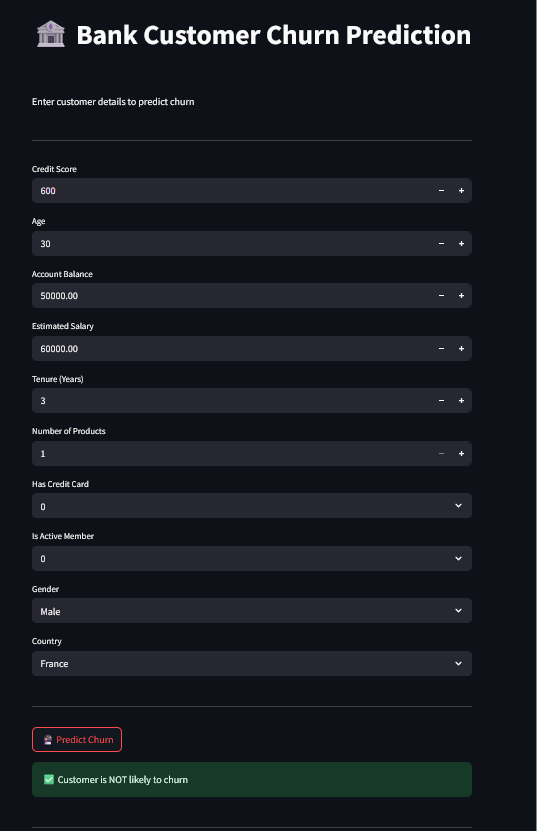
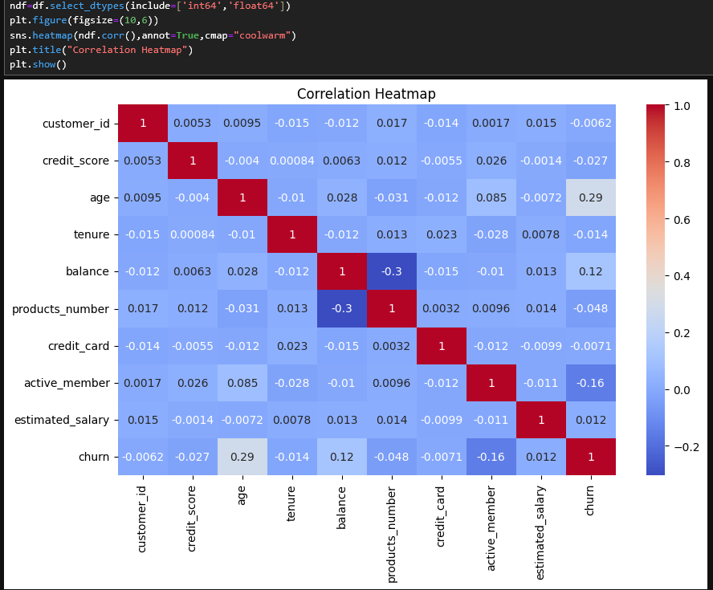
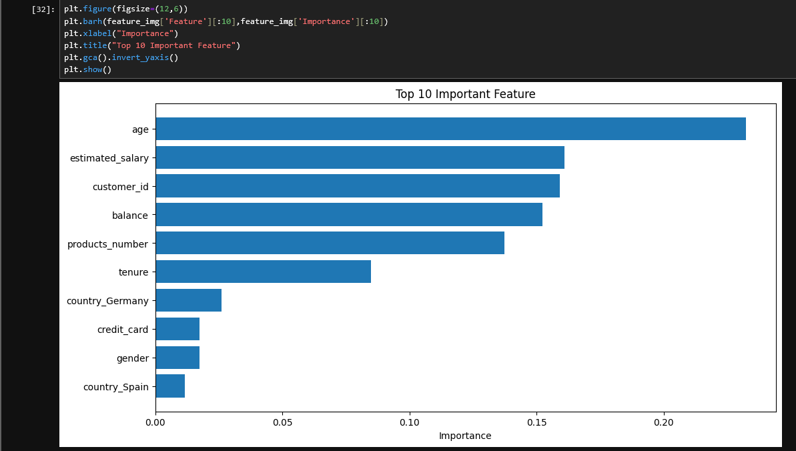

# 🏦 Bank Customer Churn Prediction

**Bank Customer Churn Prediction** is a machine learning project that predicts whether a bank customer is likely to **leave (churn)** or **stay**.  

  
*Screenshot of the interactive Streamlit/Jupyter App*

---

## 📄 Project Description

This project uses customer data such as:

- Credit Score
- Age
- Balance
- Estimated Salary
- Tenure
- Number of Products
- Credit Card Ownership
- Activity Status
- Gender
- Country

The project applies **data preprocessing, feature engineering, and machine learning algorithms** (Random Forest, Logistic Regression, XGBoost) to predict customer churn.  

**Interactive Interface:**  
Users can input customer details using **Streamlit or Jupyter Widgets** and get **real-time predictions**.

---

## 🔑 Key Highlights

- Identify customers at risk of churn  
- Helps in proactive customer retention strategies  
- Demonstrates end-to-end ML workflow:  
  `Data preprocessing → Model training → Deployment`

---

## 🖼️ Adding Images Visualization

```markdown




